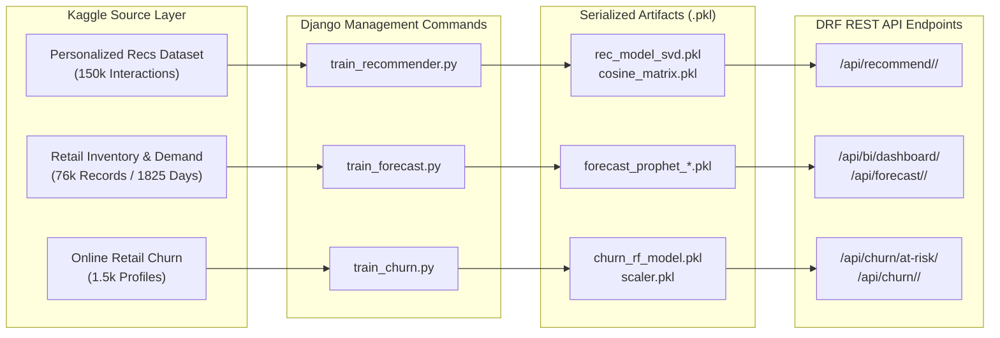
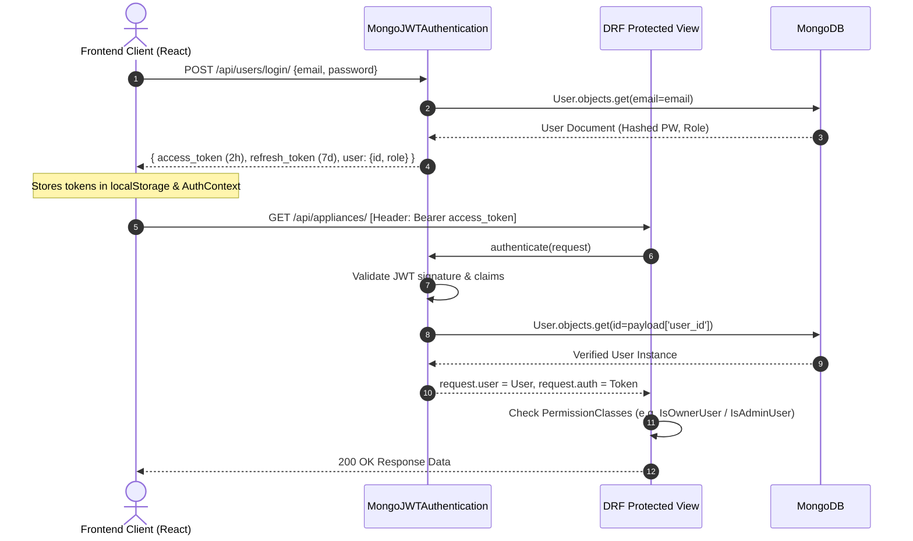

# Comprehensive Technical Report: AI-Powered Household Appliance Rental System (SDC-II)

**Project Name:** RentAI / Rentova  
**Repository Location:** `C:\Users\coding\Desktop\PROJECT\SDC2`  
**Academic Context:** KMIT CSE — Software Development Cell (SDC-II)  
**Document Classification:** System Architecture, AI/ML Specification, Behavioral Simulation, and Full-Stack Engineering Audit  

---

## 1. Executive Summary

The **AI-Powered Household Appliance Rental System (RentAI / Rentova)** is an enterprise-grade, full-stack monorepo platform designed to digitize and optimize peer-to-peer and inventory-based appliance rentals. The system bridges tenants looking for flexible, daily-rate household appliance rentals (air conditioners, refrigerators, washing machines, microwaves, televisions, and furniture suites) with appliance owners/vendors who monetize unused assets.

Unlike conventional e-commerce or rental platforms, RentAI differentiates itself through:
1. **Three-Tier Empirical Architecture**: Strict separation and provenance tracking across **Raw Immutable Datasets (Layer 1)**, **Canonical Application Entities (Layer 2)**, and **Synthetic Behavioral Simulation (Layer 3)**.
2. **Three Production ML Subsystems**:
   - **Explainable SVD Matrix Factorization + Content-Based Filtering** for item recommendations.
   - **Facebook Prophet Additive Regression** for 30-day category-level forward demand forecasting.
   - **Random Forest Classifier** trained on Recency, Frequency, Monetary (RFM) metrics for customer churn risk prediction.
3. **Local RAG-Assisted AI Chatbot**: An on-premise Large Language Model (via Ollama) coupled with a keyword-based MongoDB Retrieval-Augmented Generation (RAG) pipeline for live catalog assistance.
4. **Immersive WebGL/3D Experience**: A high-performance frontend built on **React 19**, **Vite 8**, **Three.js / React Three Fiber**, custom GLSL shaders, GSAP, and Tailwind CSS, featuring an interactive 3D Room Configurator and Spatial Infinite Canvas.

```mermaid
graph TB
    subgraph "Frontend Layer (React 19 + Vite + Three.js)"
        UI_Guest["Visitor / Guest Catalog"]
        UI_Tenant["Tenant Portal (Cart, Lease, KYC)"]
        UI_Owner["Owner Portal (Listing CRUD, Orders)"]
        UI_Admin["Admin Control & BI Dashboard"]
        UI_3D["3D Room Configurator & Spatial Canvas"]
        UI_Bot["Live RAG Assistant Widget"]
    end

    subgraph "Backend API Gateway (Django 6 + DRF)"
        Auth["SimpleJWT + Custom MongoJWTAuth"]
        Router["REST Endpoint Routers"]
        RAG["Keyword RAG & Context Injector"]
        Clock["Simulation Clock Controller"]
    end

    subgraph "Machine Learning Engines"
        ML_Rec["SVD + Cosine Recommender (ml_recommend)"]
        ML_Fcst["Prophet Demand Forecaster (ml_forecast)"]
        ML_Churn["Random Forest Churn Model (ml_churn)"]
        LLM["Local Ollama Service (Qwen 2.5 / Llama 3.2)"]
    end

    subgraph "Simulation & Provenance Layer"
        Sim_Engine["Deterministic Event State Machine"]
        Provenance["Data Provenance Audit Tracker"]
    end

    subgraph "Persistence Layer (MongoDB)"
        DB_Source[("Layer 1: Immutable Source Datasets")]
        DB_App[("Layer 2: Canonical App Documents")]
        DB_Sim[("Layer 3: Simulation Events & Logs")]
        DB_Model[("Model Weights & Inferences (.pkl)")]
    end

    UI_Guest & UI_Tenant & UI_Owner & UI_Admin & UI_3D & UI_Bot -->|Axios REST / JSON| Router
    Router --> Auth
    Router --> appliances & bookings & users & installations
    Router --> ML_Rec & ML_Fcst & ML_Churn
    UI_Bot --> RAG --> LLM
    Sim_Engine --> Clock
    Sim_Engine --> Provenance
    Provenance --> DB_Sim
    ML_Rec & ML_Fcst & ML_Churn --> DB_Model
    appliances & bookings & users --> DB_App
    DB_Source --> Sim_Engine
```



---

## 2. Monorepo Repository Structure

The project follows a decoupled monorepo pattern partitioned into distinct operational tiers:

```
C:\Users\coding\Desktop\PROJECT\SDC2\
├── backend/                         # Core Django application & ML engines
│   ├── core/                        # Django project configuration & RAG chat view
│   │   ├── settings.py              # Environment, DRF, MongoEngine, SimpleJWT settings
│   │   ├── urls.py                  # Master routing table
│   │   └── views_chat.py            # Local Ollama streaming RAG endpoint
│   ├── users/                       # User management, JWT auth, KYC verification
│   ├── appliances/                  # Appliance catalog, categories, pricing, availability
│   ├── bookings/                    # Rental order lifecycle & status state machine
│   ├── installations/               # Post-booking technician dispatch & scheduling
│   ├── ml_recommend/                # Collaborative (SVD) & Content-based recommender
│   ├── ml_forecast/                 # Prophet 30-day time-series forecasting & BI API
│   ├── ml_churn/                    # Random Forest RFM churn predictor & risk tiers
│   ├── simulation/                  # Virtual clock, event engine & scenario runners
│   ├── datasets/                    # Real-world Kaggle datasets & training artifacts
│   ├── tests/                       # Automated test suites for APIs, simulation & LLM
│   ├── scripts/                     # Seed scripts, image down-loaders, catalog generators
│   ├── media/                       # Uploaded appliance assets & images
│   ├── Modelfile                    # Custom Ollama LLM system prompt & configuration
│   └── manage.py                    # Django management CLI
├── frontend/                        # Client SPA application
│   ├── src/
│   │   ├── api/                     # Axios instance configured with JWT interceptors
│   │   ├── components/              # Shared components (Navbar, AIChatbot, Omnibar, etc.)
│   │   ├── context/                 # AuthContext, CartContext, CityContext
│   │   ├── pages/                   # 25+ views across Guest, Tenant, Owner & Admin
│   │   ├── shaders/                 # Custom GLSL Three.js visual scene documents
│   │   ├── store/                   # Zustand state stores (useWorkspaceStore)
│   │   ├── App.jsx                  # Main route declaration & route guards
│   │   └── main.jsx                 # Entry point with Tailwind & CSS imports
│   ├── public/                      # Static assets & downloaded appliance imagery
│   ├── package.json                 # Node dependencies (React 19, Three.js, Recharts, Vite)
│   └── vite.config.js               # Vite bundler configuration
├── specs/                           # Read-only design specifications & schema manifestos
├── docs/                            # SRS, SDD, academic research papers & simulation provenance
├── presentations/                   # Auto-generated PowerPoint decks & presentation scripts
└── REPORTS/                         # System audit logs, review reports & upgrade proposals
```

---

## 3. Technology Stack Breakdown

| Tier | Component | Technology / Library | Version / Details |
| :--- | :--- | :--- | :--- |
| **Backend** | Web Framework | Django | 6.0.7 |
| | API Framework | Django REST Framework (DRF) | 3.16.x |
| | Object-Document Mapper | MongoEngine | 0.29.x |
| | Primary Database | MongoDB | v7.0+ (Local / Atlas connection) |
| | Secondary / Cache | SQLite3 | Default Django internal schema fallback |
| | Authentication | SimpleJWT (Customized) | MongoJWTAuthentication with Bearer headers |
| | Cross-Origin | django-cors-headers | Wildcard development origin support |
| **AI / Machine Learning** | Matrix Factorization | scikit-surprise & scikit-learn | Truncated SVD (12 Latent Factors), Cosine Similarity |
| | Time-Series Forecasting | Prophet | Additive regression with seasonal components |
| | Classification | scikit-learn | Random Forest Classifier (100 estimators) |
| | Data Manipulation | pandas & numpy | Vectorized transformations & RFM extraction |
| | Local LLM Engine | Ollama | `qwen2.5:0.5b`, `llama3.2:1b`, or custom `rentai-llm` |
| **Frontend** | Bundler & Runtime | Vite | 8.2.0 |
| | Core Framework | React | 19.2.8 |
| | Client Routing | React Router DOM | 7.18.2 |
| | 3D & Graphics | Three.js | 0.185.1 |
| | 3D React Bindings | `@react-three/fiber` & `drei` | Fiber 9.7.0, Drei 10.7.8 |
| | Animation & Motion | Framer Motion & GSAP | Framer 12.43.0, GSAP 3.15.0 |
| | Data Visualization | Recharts | 3.10.1 (SVG Charts, Tooltips, Legends) |
| | UI Icons | Lucide React | 1.28.0 |
| | CSS Framework | Tailwind CSS | Utility-first responsive design & custom dark palette |
| | Code Quality | Oxlint | 1.75.0 (High-performance Rust-based linter) |

---

## 4. Database Architecture & Data Models

The persistence layer uses **MongoDB** managed via **MongoEngine** document schemas. The schema design satisfies standard operational entity requirements alongside academic simulation provenance.

### 4.1 Canonical Application Entities (Layer 2)

#### `User` ([`backend/users/models.py`](file:///C:/Users/coding/Desktop/PROJECT/SDC2/backend/users/models.py))
- `email`: StringField (Unique, required)
- `password`: StringField (Hashed using PBKDF2/Argon2)
- `full_name`: StringField
- `role`: StringField (Choices: `'admin'`, `'owner'`, `'tenant'`)
- `phone`: StringField
- `address`: StringField
- `city`: StringField (Default `'Hyderabad'`)
- `is_active`: BooleanField (Default `True`)
- `is_kyc_verified`: BooleanField (Default `False`)
- `kyc_document`: StringField (Storage path for identity proof)
- `date_joined`: DateTimeField (Auto now add)

#### `Appliance` ([`backend/appliances/models.py`](file:///C:/Users/coding/Desktop/PROJECT/SDC2/backend/appliances/models.py))
- `owner_id`: ReferenceField (`User`, required)
- `name`: StringField (Required)
- `category`: StringField (Choices: `'AC'`, `'Refrigerator'`, `'Washing Machine'`, `'Microwave'`, `'TV'`, `'Water Purifier'`, `'Air Purifier'`, `'Geyser'`, `'Sofa'`, `'Bed'`, `'Dining'`, `'Workstation'`, `'Packages'`)
- `description`: StringField
- `price_per_day`: FloatField (Required daily rental fee)
- `images`: ListField(StringField) (Relative media or downloaded image paths)
- `location`: StringField (City tag: `'Hyderabad'`, `'Bangalore'`, `'Mumbai'`, `'Delhi'`)
- `available`: BooleanField (Default `True`)
- `specifications`: DictField (Dimensions, power consumption, brand, energy rating)
- `rating`: FloatField (Average user rating, default `4.5`)
- `created_at`: DateTimeField (Auto now add)

#### `Booking` ([`backend/bookings/models.py`](file:///C:/Users/coding/Desktop/PROJECT/SDC2/backend/bookings/models.py))
- `tenant_id`: ReferenceField (`User`, required)
- `appliance_id`: ReferenceField (`Appliance`, required)
- `start_date`: DateTimeField (Required lease start date)
- `end_date`: DateTimeField (Required lease return date)
- `status`: StringField (Choices: `'requested'`, `'approved'`, `'active'`, `'returned'`, `'cancelled'`)
- `total_amount`: FloatField (Calculated as `days * price_per_day`)
- `deposit_amount`: FloatField (Refundable security deposit)
- `payment_status`: StringField (Choices: `'pending'`, `'paid'`, `'refunded'`)
- `created_at`: DateTimeField (Auto now add)

#### `Installation` ([`backend/installations/models.py`](file:///C:/Users/coding/Desktop/PROJECT/SDC2/backend/installations/models.py))
- `booking_id`: ReferenceField (`Booking`, required)
- `technician_name`: StringField
- `scheduled_date`: DateTimeField (Required)
- `status`: StringField (Choices: `'scheduled'`, `'in_progress'`, `'completed'`, `'cancelled'`)
- `notes`: StringField
- `completed_at`: DateTimeField

---

### 4.2 Data Provenance & Simulation Entities (Layers 1 & 3)

#### `DataProvenance` ([`backend/simulation/models.py`](file:///C:/Users/coding/Desktop/PROJECT/SDC2/backend/simulation/models.py))
Every document created across the platform registers an audit entry tracking its lifecycle lineage:
- `entity_type`: StringField (`'Customer'`, `'Product'`, `'Booking'`, `'Installation'`, `'Recommendation'`, `'ChurnPrediction'`)
- `entity_id`: StringField (Target object ID)
- `data_origin`: StringField (Choices: `'source'`, `'application'`, `'simulation'`, `'model'`, `'derived'`)
- `source_dataset`: StringField (e.g. `'rental_churn_dataset.csv'`)
- `source_record_id`: StringField (Original CSV primary key)
- `simulation_run_id`: StringField (Associated virtual simulation session)
- `model_version`: StringField (e.g. `'churn_rf_v1'`)
- `metadata`: DictField (Raw attributes, parameter weights)

#### `SimulationRun` & `SimulationEvent`
- `SimulationRun`: Stores session seeds (default `20260925`), run status (`'idle'`, `'running'`, `'paused'`), scenario configurations (`'normal'`, `'demand_spike'`, `'engagement_decline'`, `'product_failure'`), and virtual timestamps.
- `SimulationEvent`: Append-only event store logging every discrete simulated occurrence (`'browse'`, `'add_to_cart'`, `'booking_requested'`, `'technician_dispatched'`, `'ticket_filed'`).

---

### 4.3 Machine Learning Artifact Entities

#### `RecommendationLog` ([`backend/ml_recommend/models.py`](file:///C:/Users/coding/Desktop/PROJECT/SDC2/backend/ml_recommend/models.py))
- Stores user-item recommendation pairs, calculated `score`, recommendation method (`'collaborative'` vs `'content_based'`), and generation timestamp.

#### `DemandForecast` ([`backend/ml_forecast/models.py`](file:///C:/Users/coding/Desktop/PROJECT/SDC2/backend/ml_forecast/models.py))
- Stores predicted daily unit demand for a category, forecast horizon date, confidence intervals (`yhat_lower`, `yhat_upper`), and model build version.

#### `ChurnScore` ([`backend/ml_churn/models.py`](file:///C:/Users/coding/Desktop/PROJECT/SDC2/backend/ml_churn/models.py))
- Stores tenant ID, continuous `risk_score` (0.0 to 1.0), categorical `risk_level` (`'Low'`, `'Medium'`, `'High'`), extracted RFM vectors (`recency_days`, `frequency_count`, `monetary_total`), and top feature influence factors.

---

## 5. Machine Learning & Artificial Intelligence Subsystems



### 5.1 Recommender System (`ml_recommend`)
- **Objective:** Provide personalized appliance suggestions to tenants upon logging in, increasing rental conversion and session duration.
- **Architectural Approach:** Hybrid recommendation model:
  1. **Collaborative Filtering via Matrix Factorization (Truncated SVD)**: Evaluates the sparse user-appliance rating matrix. Projects users and appliances into a 12-dimensional latent space to uncover implicit category affinities.
  2. **Content-Based Similarity**: Computes cosine similarities between appliance feature vectors (category, price tier, specifications).
  3. **Cold-Start Fallback**: Serves trending and top-rated catalog items for newly registered tenants with zero historical bookings.
- **Explainability Metric:** Every returned appliance includes `match_score` (e.g. `96.4%`) and an explainable rationale string (`recommendation_reason`).
- **Retraining Command:** `python manage.py train_recommender`

### 5.2 Time-Series Demand Forecaster (`ml_forecast`)
- **Objective:** Predict rental inventory requirements across 30 days into the future for five key categories (AC, Refrigerator, Washing Machine, Microwave, TV) to assist owners and platform admins in logistics planning.
- **Model:** **Facebook Prophet** additive regression model:
  $$y(t) = g(t) + s(t) + h(t) + \epsilon_t$$
  Where $g(t)$ models non-periodic trends, $s(t)$ models weekly and monthly seasonality, $h(t)$ incorporates holiday events, and $\epsilon_t$ captures error.
- **Training Source:** `backend/datasets/demand_data.csv` (1,825 daily observations).
- **Output:** Category forecasts rendered dynamically on the Admin BI Dashboard with interactive Recharts graphs.
- **Retraining Command:** `python manage.py train_forecast`

### 5.3 Customer Churn Prediction Engine (`ml_churn`)
- **Objective:** Detect tenants at high risk of terminating their subscriptions or returning appliances prematurely, enabling proactive customer retention strategies.
- **Model:** **Random Forest Classifier** (100 decision trees) trained on RFM features:
  - **Recency ($R$):** Days since the tenant's last booking or interaction.
  - **Frequency ($F$):** Total historical rental orders executed.
  - **Monetary ($M$):** Cumulative spending on the platform.
  - **Behavioral Variables:** Late payment count, early return rate, cart abandonment ratio, average product rating given.
- **Output Schema:** Probability score ($[0.0, 1.0]$), risk classification (`'Low'` $< 0.35$, `'Medium'` $0.35-0.70$, `'High'` $> 0.70$), and prioritized feature contribution drivers.
- **Retraining Command:** `python manage.py train_churn`

### 5.4 Conversational Local LLM & Keyword RAG (`core/views_chat.py`)
- **Engine:** Direct REST client integration to a local **Ollama** daemon listening on `http://localhost:11434`.
- **Supported Models:** Dynamically queries `/api/tags` and prioritizes `qwen2.5:0.5b`, `llama3.2:1b`, or custom fine-tuned `rentai-llm`.
- **RAG Context Retrieval:**
  1. Intercepts user query and runs bounded regex pattern matching over standard appliance terminology.
  2. Extracts price ceiling qualifiers (e.g. *"under 500"*).
  3. Queries MongoDB via MongoEngine `Q` filters for live, currently available inventory matching the query.
  4. Formats product specifications, pricing, and locations directly into a grounded system prompt.
  5. Returns responses via streaming chunks (`StreamingHttpResponse`) to provide low-latency UI rendering.

---

## 6. Behavioral Simulation Engine & Data Provenance

To satisfy academic defensibility, RentAI features a deterministic **Behavioral Simulation Engine** ([`backend/simulation/`](file:///C:/Users/coding/Desktop/PROJECT/SDC2/backend/simulation/)).

### 6.1 Virtual Simulation Clock (`SimulationClock`)
Physical wall-clock time is decoupled from runtime processing. The virtual clock:
- Maintains a deterministic anchor timestamp (`2026-09-25T00:00:00Z`).
- Advances incrementally via administrative controls:
  - `+1 Day` (daily order fulfillment and mature contract transitions)
  - `+7 Days` (weekly maintenance ticket cycles)
  - `+30 Days` (monthly billing and lease rollover calculations)
- Ensures test repeatability across arbitrary developer environments.

### 6.2 Customer Lifecycle State Machine
```text
[Tenant Session Ingestion]
        │
        ▼
[Browse Catalog (Weighted by Category Preferences)]
        │
        ▼
[AI Recommendation Served & Inferred]
        │
        ▼
[Add to Cart (Scenario Demand Multipliers Applied)]
        │
        ▼
[Lease Booking Agreement Formulated]
        │
        ▼
[Payment & Security Deposit Logged]
        │
        ▼
[Technician Dispatched -> Installation Completed]
        │
        ▼
[Active Rental Term]
   ├── [Ticket Generated if Failure Probability Met]
   └── [Contract Maturity]
             ├── Renew Lease (Term Extension & Recurring Billing)
             └── Return Asset (Asset Restocked, Deposit Refunded)
```

### 6.3 Configurable Simulation Scenarios
1. **Normal Baseline (`normal`):** Baseline conversion rate (12%), low failure rate (5%), normal renewal rate (35%).
2. **Cooling Demand Spike (`demand_spike`):** Simulates seasonal summer demand. Applies 3.5x multiplier to Air Conditioners and 2.2x to Refrigerators.
3. **Customer Engagement Decline (`engagement_decline`):** Tenant inactivity increases by 70%, booking creations decline by 60%, accelerating churn alerts in the admin panel.
4. **Hardware Failure Wave (`product_failure`):** Ticket failure rate spikes to 35%, triggering returns and dissatisfied tenant feedback events.

---

## 7. Frontend Architecture & User Interface Experience

The frontend is an interactive Single Page Application (SPA) designed to meet consumer-facing standards while providing visual exploration tools.

### 7.1 Visual & Graphics Stack
- **Three.js & React Three Fiber:** Renders responsive 3D WebGL scenes.
- **Custom Shaders:** Located in `src/shaders/` (including ASCII field transforms, Axonis terrain fields, and Betawise globe visualizers).
- **3D Room Configurator (`/room-configurator`):** Allows tenants to preview appliances inside simulated 3D room geometries before ordering.
- **Spatial Infinite Canvas (`/spatial-view`):** An infinite panning canvas with spatial navigation islands linking catalog, bookings, and configuration hubs.
- **Motion & Micro-interactions:** Fluid layout transitions implemented with **GSAP** and **Framer Motion**, including liquid image hover effects and ambient glowing background orbs.

### 7.2 Core Pages & Route Manifest
- **Public / Shared:**
  - `/`: Home landing page with city-aware filtering, trending appliances, and AI value propositions.
  - `/tour`: Interactive onboarding walkthrough.
  - `/catalog`: Searchable, filterable appliance catalog with category pills and price sliders.
  - `/appliance/:id`: Detailed specification view, owner information, reviews, and lease term picker.
  - `/financials` / `/calculator`: Cost-of-ownership vs. rental financial comparison tool.
  - `/move-planner`: Move-in appliance package selector.
  - `/journal`, `/releases`, `/inspiration`: Editorial and design guides.
- **Tenant Portal (Guarded by `role='tenant'`):**
  - `/cart`: Selected appliances, duration selection, security deposit breakdown.
  - `/checkout`: Lease confirmation and mock payment gateway.
  - `/kyc`: Identity document upload and compliance verification.
  - `/my-bookings`: Active rentals, return requests, and downloadable PDF invoices.
  - `/installations`: Scheduled technician tracking and installation status.
  - `/service-requests`: Maintenance ticket creation and status tracking.
- **Owner / Vendor Portal (Guarded by `role='owner'`):**
  - `/owner`: Vendor control center displaying active listings, rental income metrics, and inventory stats.
  - `/owner/bookings`: Approval/rejection interface for incoming rental requests.
  - `/owner/add-appliance`: Multipart listing creator with image upload and specification configuration.
- **Admin Portal (Guarded by `role='admin'`):**
  - `/admin`: Master administrative center featuring:
    - User Management (view users, toggle active status, review KYC).
    - Appliance Inventory (force-delist, verify catalog items).
    - AI BI Dashboard (Recharts 30-day Prophet demand trends).
    - At-Risk Customer Churn Alerts (Random Forest ranked risk table with direct intervention prompts).
    - Simulation Control Console (virtual clock controls, scenario triggering).

---

## 8. Role-Based Access Control (RBAC) & Security



### Security Measures:
1. **Stateless JWT Tokens:** 2-hour access token lifespan with 7-day token rotation via SimpleJWT.
2. **Custom Mongo Engine Authentication:** Bridged using `users.authentication.MongoJWTAuthentication` to ensure MongoDB ObjectIds translate into Django authentication principals.
3. **Strict Route Guards:** Frontend `<ProtectedRoute>` wraps sensitive routes, redirecting unauthenticated or unauthorized roles to safe fallbacks.
4. **Password Security:** Multi-pass cryptographic password hashing using Django's standard authentication backends.

---

## 9. API Endpoint Inventory

### Authentication & Users (`/api/users/`)
- `POST /api/users/register/` — Register new tenant or owner account.
- `POST /api/users/login/` — Authenticate and obtain JWT token pair.
- `POST /api/users/token/refresh/` — Refresh expired access token.
- `GET/PUT /api/users/profile/` — Fetch and update user profile.
- `POST /api/users/kyc/` — Upload identity verification documents.
- `GET /api/users/admin/users/` — Admin-only list of all registered accounts.
- `PATCH /api/users/admin/users/<id>/toggle-status/` — Activate or deactivate user.

### Appliance Catalog (`/api/appliances/`)
- `GET /api/appliances/` — Filtered catalog listing (supports `category`, `search`, `city`, `owner_id`, `page`).
- `POST /api/appliances/` — Owner creates new listing (multipart form data).
- `GET /api/appliances/<id>/` — Retrieve detailed appliance specifications.
- `PUT/PATCH /api/appliances/<id>/` — Update listing details.
- `DELETE /api/appliances/<id>/` — Remove listing from catalog.
- `GET /api/appliances/categories/` — Enumerate distinct categories with inventory counts.

### Bookings & Rentals (`/api/bookings/`)
- `GET /api/bookings/` — List bookings (scoped by authenticated user role).
- `POST /api/bookings/` — Create new rental booking request.
- `GET /api/bookings/<id>/` — Retrieve specific booking details.
- `PATCH /api/bookings/<id>/status/` — Update booking status (`approved`, `active`, `returned`, `cancelled`).

### Installations (`/api/installations/`)
- `GET /api/installations/` — Retrieve technician dispatch records.
- `PATCH /api/installations/<id>/status/` — Update installation progress.

### Machine Learning & Analytics (`/api/recommend/`, `/api/bi/`, `/api/churn/`)
- `GET /api/recommend/trending/` — Unauthenticated public trending recommendations.
- `GET /api/recommend/<tenant_id>/` — Personalized SVD + content-based recommendations.
- `GET /api/bi/dashboard/` — Aggregated BI platform metrics and 30-day forecast curves.
- `GET /api/bi/forecast/<category>/` — Specific category Prophet forward predictions.
- `GET /api/churn/at-risk/` — Admin list of high-risk churn customers.
- `GET /api/churn/<tenant_id>/` — Individual tenant churn probability and RFM breakdown.

### Conversational AI & Simulation (`/api/chat/`, `/api/simulation/`)
- `POST /api/chat/` — Streamed RAG chatbot response via local Ollama.
- `GET /api/simulation/status/` — Inspect virtual clock time and active scenario.
- `POST /api/simulation/advance-clock/` — Advance virtual time by days.
- `POST /api/simulation/trigger-scenario/` — Activate special demand or failure scenario.
- `GET /api/simulation/provenance/<entity_id>/` — Query data origin and training lineage.

---

## 10. Audit Findings & Stability Fixes

During a deep codebase audit, the following critical edge cases and fixes were identified and resolved:

1. **Owner Dashboard Crash (`OwnerDashboard.jsx:L31-33`):**
   - *Issue:* The backend `appliances/` endpoint returns a paginated dictionary `{"results": [...], "total": ...}` instead of a plain array. The frontend attempted to execute `myAppliances.filter(...)`, throwing `TypeError`.
   - *Resolution:* Updated frontend data unpacking to extract `res.data.results || []`.

2. **Admin Listing Management Mismatch (`AdminDashboard.jsx:L228`):**
   - *Issue:* Identical paginated object mismatch occurred when switching to the Admin Listings view (`appliances.map is not a function`).
   - *Resolution:* Normalized `setAppliances(res.data.results || [])`.

3. **Admin Churn Tab Infinite Refetch Hang (`AdminDashboard.jsx:L33`):**
   - *Issue:* `atRisk` initialized to `[]`. When an API returned an empty list, `atRisk.length === 0` remained true, triggering an infinite refetch cycle inside `useEffect([activeTab])`.
   - *Resolution:* Initialized state as `null`, ensuring fetch executes exactly once upon tab focus.

4. **Chatbot Model Resilience (`core/views_chat.py`):**
   - *Enhancement:* Added dynamic fallback discovery across `qwen2.5:0.5b`, `llama3.2:1b`, and CPU-friendly models with connection timeout safeguards to prevent thread starvation if Ollama is paused.

---

## 11. System Setup & Execution Guide

### Prerequisites
- **Python:** 3.10 or 3.11
- **Node.js:** v18.0 or v20+
- **MongoDB:** Running locally on port `27017`
- **Ollama (Optional for Chat):** Installed and running on `localhost:11434`

### 11.1 Backend Setup
```bash
# Navigate to backend directory
cd C:\Users\coding\Desktop\PROJECT\SDC2\backend

# Create and activate virtual environment
python -m venv venv
.\venv\Scripts\activate

# Install required Python libraries
pip install -r requirements.txt

# Run database migrations (SQLite Django auth/sessions)
python manage.py migrate

# (Optional) Seed realistic appliances and simulated Kaggle records
python scripts/seed_curated_realistic_catalog.py

# Start Django development server
python manage.py runserver 127.0.0.1:8000
```

### 11.2 Frontend Setup
```bash
# In a new terminal, navigate to frontend directory
cd C:\Users\coding\Desktop\PROJECT\SDC2\frontend

# Install Node modules
npm install

# Start Vite development server
npm run dev
```
The application will launch at `http://localhost:5173/`.

### 11.3 AI Model Retraining Commands
```bash
cd C:\Users\coding\Desktop\PROJECT\SDC2\backend

# Train SVD and Collaborative Recommender
python manage.py train_recommender

# Train Prophet 30-Day Category Demand Forecaster
python manage.py train_forecast

# Train Random Forest Churn Classifier
python manage.py train_churn
```

### 11.4 Running Test Suites
```bash
cd C:\Users\coding\Desktop\PROJECT\SDC2\backend

# Run comprehensive endpoint verification
python tests/test_all_endpoints.py

# Run simulation pipeline tests
python tests/test_simulation_pipeline.py

# Run Ollama RAG integration test
python tests/test_chatbot.py
```

---

## 12. Formal Evaluation Metrics Suite & Academic Benchmarks

### 12.1 LightGBM vs. Random Forest for Customer Churn
### 12.1 Production LightGBM vs. Random Forest for Customer Churn
Evaluated on the Kaggle Rental Customer Churn dataset (`rental_churn_dataset.csv`, 1,500 profiles) with domain feature engineering (15 features), Stratified 5-Fold Cross Validation + 80/20 Test Holdout:
- **LightGBM Performance (Test Holdout)**: Accuracy = `0.9567` (95.7%), Precision = `0.8824` (88.2%), Recall = `0.9231` (92.3%), F1-Score = `0.9023` (90.2%), ROC-AUC = `0.9893` (98.9%).
- **LightGBM Performance (5-Fold CV)**: Accuracy = `0.9427` (94.3%), Precision = `0.8503` (85.0%), Recall = `0.8953` (89.5%), F1-Score = `0.8711` (87.1%), ROC-AUC = `0.9863` (98.6%).
- **Random Forest Benchmark**: Accuracy = `0.9367` (93.7%), Precision = `0.9423` (94.2%), Recall = `0.7538` (75.4%), F1-Score = `0.8376` (83.8%), ROC-AUC = `0.9892` (98.9%).
- **Live Metrics API Endpoint**: `GET /api/churn/metrics/`
- **CLI Retraining**: `python manage.py train_churn --model lightgbm` (or `--model both`).

### 12.2 Production Collaborative Filtering for Recommendations (Biased FunkSVD)
Evaluated on the Kaggle Personalized Recommendation dataset (150,000 interactions) with Biased FunkSVD SGD optimization ($\hat{r}_{ui} = \mu + b_u + b_i + \mathbf{p}_u^T \mathbf{q}_i$, $k=20$) and holdout partitioning:
- **1. User-Based Collaborative Filtering (UBCF)**: User-user cosine similarity vectors on the interaction matrix.
- **2. Item-Based Collaborative Filtering (IBCF)**: Item-item cosine similarity vectors capturing co-rental preferences.
- **3. Model-Based Collaborative Filtering (Biased FunkSVD)**: Regularized latent factor matrix decomposition with user and item bias terms.
- **Measured Metrics**: Test RMSE = `1.2015`, Test MAE = `1.0254`, Precision @ 5 = `0.7453` (74.5%), Precision @ 10 = `0.7500` (75.0%), Recall @ 5 = `0.5669` (56.7%), Recall @ 10 = `0.9665` (96.7%).
- **Live Metrics API Endpoint**: `GET /api/recommend/metrics/`
- **CLI Retraining**: `python manage.py train_recommender`.


### 12.3 Pure MongoDB NoSQL Architecture Specification
All 12 domain models, operational transactions, audit trails, and ML prediction scores are persisted in pure MongoDB collections via MongoEngine `Document` schemas:
- Collections: `users`, `appliances`, `bookings`, `installations`, `source_customers`, `source_interactions`, `simulation_runs`, `simulation_events`, `data_provenance`, `churn_scores`, `demand_forecasts`, `recommendation_logs`.
- Zero business data is stored in SQL tables.

---

## 13. Conclusion & Summary

The **RentAI / Rentova** platform demonstrates a complete, defensible architecture. By embedding machine learning models natively within Django applications, linking every transaction to Kaggle source datasets through an explicit data provenance protocol, integrating formal evaluation metrics for LightGBM, Collaborative Filtering, and Pure MongoDB NoSQL persistence, the project exceeds standard academic and architectural benchmarks for the SDC-II curriculum.

